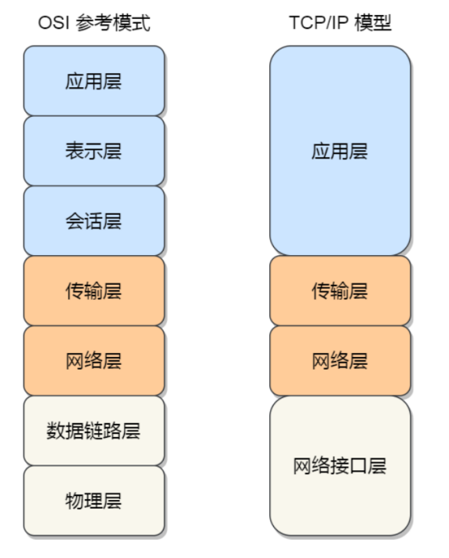
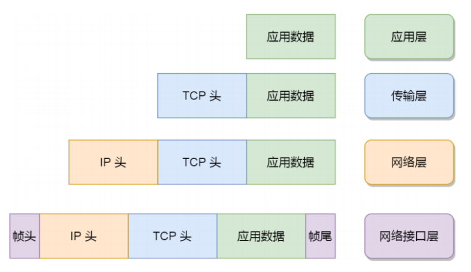

# CN1. TCP/IP模型和OSI模型   
   

## 教程  
  
[OSI模型(text)](https://www.geeksforgeeks.org/open-systems-interconnection-model-osi/)  
[TCP/IP模型(text)](https://www.geeksforgeeks.org/tcp-ip-model/?ref=lbp)  
[OSI & TCP/IP模型(videos)](https://www.youtube.com/playlist?list=PLBbU9-SUUCwUyqvfypPAHWOaDr7Wz4P6t)  

  
## 解答  

### OSI 七层参考模型  
  
  
  
OSI（Open System Interconnection）模型，即开放式系统互联，是国际标准化组织（ISO）制定的⼀个用于计算机或通信系统间互联的标准体系，旨在**将计算机网络通信划分为七个不同的层级，每个层级都负责特定的功能。每个层级都构建在其下方的层级之上，并为上方的层级提供服务。七层从下到上分别是物理层、数据链路层、网络层、传输层、会话层、表示层和应用层。可以简称为“物数网传会表应”**。

1.  **物理层**: 负责物理传输媒介的传输，例如电缆、光纤或无线信号。主要作用是传输比特流（就是由 1、0 转化为电流强弱来进行传输，到达目的地后再转化为 1、0，也就是我们常说的数模转换与模数转换）。**这一层的数据叫做比特**。

2. **数据链路层**: 建立逻辑连接、进行硬件地址寻址、差错校验等功能。定义了如何让格式化数据以帧为单位进行传输，以及如何控制对物理介质的访问。将⽐特组合成字节进⽽组合成帧，用 MAC 地址访问介质，**传输单位是帧**。

3.  **网络层**:  **负责数据的路由和转发**，选择最佳路径将数据从源主机传输到目标主机。它使用IP地址来标识不同主机和网络，并进行逻辑地址寻址。**传输单位是数据报。常见的协议有ICMP、ARP、IP**

4.  **传输层**: **提供端到端的数据传输服务**。它使用TCP（传输控制协议）和UDP（用户数据报协议）来管理数据传输。

5. **会话层**: 建立、管理和终止应用程序之间 的会话连接。它处理会话建立、维护和终止，以及处理会话过程中的异常情况。

6. **表示层**: 负责数据的格式转换、加密和解密，确保数据在不同系统之间的正确解释和呈现，也就是把计算机能够识别的东西转换成⼈能够能识别的东西（如图⽚、声音等）。
 
7. **应用层**:  网络服务与最终用户的⼀个接口。这⼀层为用户的应用程序（例如电子邮件、文件传输和终端仿真）提供网络服务。**常见的协议有：FTP、SMTP、HTTP、DNS**。  
  
OSI七层网络模型为网络通信的不同功能提供了逻辑上的划分，为网络协议的设计和实现提供了标准化的框架。然⽽，在实际网络通信中，常用的TCP/IP协议栈更为⼴泛和普遍。 
  

### TCP/IP四层网络模型

TCP/IP模型是⼀种用于组织和描述计算机网络通信的标准模型，**它是互联网最常用的协议栈**。TCP/IP模型由两个主要协议组成：TCP（Transmission Control Protocol）和IP（Internet Protocol）。它是互联网通信的基础，也被⼴泛用于局域网和⼴域网等各种网络环境。  

TCP/IP模型分为四个层级，每个层级负责特定的网络功能。以下是TCP/IP模型的层级及其功能：  

1. **应用层（Application Layer）：该层与OSI模型的应用层和表示层以及会话层类似，提供直接与用户应用程序交互的接口。**它为网络上的各种应用程序提供服务，如电子邮件（SMTP）、网页浏览（HTTP）、文件传输（FTP）等。
2. **传输层（Transport Layer）：该层对应OSI模型的传输层。它负责端到端的数据传输，提供可靠的、无连接的数据传输服务。**主要的传输层协议有TCP（Transmission Control Protocol）和UDP（User Datagram Protocol）。TCP提供可靠的数据传输，确保数据的正确性和完整性；⽽UDP则是无连接的，适用于不要求可靠性的传输，如实时音频和视频流。
3. **网际层（Internet Layer）：该层对应OSI模型的网络层。主要协议是IP（Internet Protocol），它负责数据包的路由和转发**，选择最佳路径将数据从源主机传输到目标主机。IP协议使用IP地址来标识主机和网络，并进行逻辑地址寻址。
4. **网络接口层（Link Layer）：该层对应OSI模型的数据链路层和物理层。**它负责物理传输媒介的传输，例如以太网、Wi-Fi等，并提供错误检测和纠正的功能。此外，网络接口层还包含硬件地址（MAC地址）的管理。  

TCP/IP模型和OSI七层网络模型有些相似，但并不完全⼀样。TCP/IP模型较为简洁，只分为四个层级，⽽OSI模型分为七个层级。虽然OSI模型在理论上更全面，但在实际网络通信中，TCP/IP模型更为实用，并且成为了互联网通信的主要参考模型。

### 两种网络模型的对比

  
- 应用层，负责向用户提供一组应用程序，比如HTTP、DNS、FTP等；
- 传输层，负责端到端的通信，比如TCP、UDP等；
- 网络层，负责网络包的封装、分片、路由、转发，比如IP、ICMP等；
- 网络接口层，负责网络包在物理网络中的传输，比如网络包的封帧、MAC寻址、差错检测，以及通过网卡传输网络帧等；  

对应的数据封装：  
  

### 五层网络体系结构  
  
    五层网络体系结构是综合了OSI模型和TCP/IP模型所得来的。

五层网络体系结构分别为：**应用层、运输层、网络层、数据链路层、物理层**。各层功能分别如下：  

1. 应用层（Application Layer）：与直接为用户的应用进程提供服务，是操作系统中的用户态，常见的有支持万维网应用的HTTP协议、支持电子邮件的SMTP协议，支持文件传送的FTP协议等等。
2. 传输层（Transport Layer）：负责向两个主机中**进程**之间的通信提供服务，是端（端口）到端的通信。传输层有两个传输协议。
    - TCP：面向连接的、可靠的传输控制协议
    - UDP: 无连接的，不提供可靠服务的用户数据报协议。
3. 网络层（Network Layer）：负责数据的路由和转发。它选择最佳路径将数据从源主机传输到目标主机，并使用逻辑地址（如IP地址）来标识主机和网络。
4. 数据链路层（Data Link Layer）：在直连网络中传输数据帧。它提供错误检测和纠正的功能，并负责数据的帧同步、地址寻址和流量控制。在这⼀层级上，通常会使用MAC地址来标识网络设备。
5. 物理层（Physical Layer）：负责物理传输媒介的传输。这包括电缆、光纤、无线信号等。该层级定义了传输数据位的形式、电压级别、传输速率等特性。