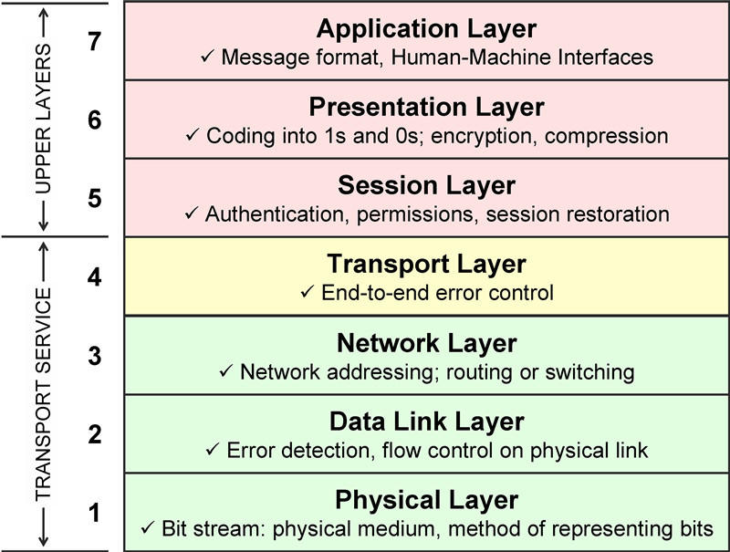
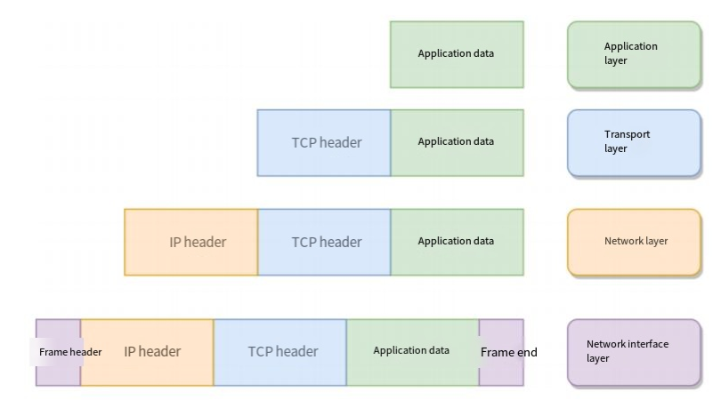

# CN1. TCP/IP Model and OSI Model  
   

## Tutorials  

[OSI model (text)](https://www.geeksforgeeks.org/open-systems-interconnection-model-osi/)  
[TCP/IP model (text)](https://www.geeksforgeeks.org/tcp-ip-model/?ref=lbp)  
[OSI & TCP/IP model (videos)](https://www.youtube.com/playlist?list=PLBbU9-SUUCwUyqvfypPAHWOaDr7Wz4P6t)  

  
## Solution

### The OSI Seven-Layer Reference Model

The OSI (Open System Interconnection) model is a standard framework developed by the International Organization for Standardization (ISO) for interconnection between computers or communication systems. It aims to **divide computer network communication into seven distinct layers, each responsible for specific functions.** Each layer is built on top of the layer below it and provides services to the layer above it. The seven layers from bottom to top are: Physical Layer, Data Link Layer, Network Layer, Transport Layer, Session Layer, Presentation Layer, and Application Layer. 

1.  **Physical Layer:** Responsible for transmission over physical transmission media, such as cables, optical fibers, or wireless signals. Its main function is to transmit bit streams (which are transmitted by converting 1s and 0s into different current strengths, and then converted back to 1s and 0s at the destination, which is what we often call digital-to-analog conversion and analog-to-digital conversion). **The data at this layer is called bits**.

2. **Data Link Layer:** Responsible for establishing logical connections, performing hardware address addressing, error checking, etc. It defines how to transmit formatted data in units of frames and how to control access to physical media. Combines bits into bytes and then frames, accesses the media using MAC addresses, **and the transmission unit is a frame.**

3.  **Network Layer:** **Responsible for data routing and forwarding,** selecting the best path to transmit data from the source host to the destination host. It uses IP addresses to identify different hosts and networks, and performs logical address addressing. **The transmission unit is a datagram. Common protocols include ICMP, ARP, IP.**

4.  **Transport Layer:** **Provides end-to-end data transmission services.** It uses TCP (Transmission Control Protocol) and UDP (User Datagram Protocol) to manage data transmission.

5. **Session Layer:** Establishes, manages, and terminates session connections between applications. It handles session establishment, maintenance and termination, as well as handling exceptions during the session.

6. **Presentation Layer:** Responsible for data format conversion, encryption and decryption, ensuring correct interpretation and presentation of data across different systems, that is, converting what the computer can recognize into what people can recognize (such as pictures, sounds, etc.).
 
7. **Application Layer:** The interface between network services and end users. This layer provides network services for user applications such as electronic mail, file transfer and terminal emulation. **Common protocols are: FTP, SMTP, HTTP, DNS**.

The OSI seven-layer network model provides a logical division of the different functions of network communication and a standardized framework for the design and implementation of network protocols. However, in actual network communication, the commonly used TCP/IP protocol stack is more widespread and common.

### TCP/IP Four-Layer Network Model

The TCP/IP model is a standard model for organizing and describing computer network communications. It is the most commonly used protocol stack on the Internet. The TCP/IP model consists of two main protocols: TCP (Transmission Control Protocol) and IP (Internet Protocol). It is the foundation of Internet communication and is also widely used in a variety of network environments such as LANs and WANs.

The TCP/IP model is divided into four layers, each responsible for specific networking functions. Below are the layers of the TCP/IP model and their functions:

1. **Application Layer:** Similar to the application, presentation, and session layers of the OSI model, this layer provides an interface that interacts directly with user applications. It provides services for a variety of applications on the network, such as email (SMTP), web browsing (HTTP), file transfer (FTP), and more.
2. **Transport Layer:** This layer corresponds to the transport layer of the OSI model. It is responsible for end-to-end data transmission and provides reliable, connectionless data transmission services. **The main transport layer protocols are TCP (Transmission Control Protocol) and UDP (User Datagram Protocol).** TCP provides reliable data transmission to ensure data correctness and integrity, while UDP is connectionless and is suitable for transmissions that do not require reliability, such as real-time audio and video streams.
3. **Internet Layer:** This layer corresponds to the network layer of the OSI model. **The main protocol is IP (Internet Protocol), which is responsible for data packet routing and forwarding**, selecting the best path to transmit data from the source host to the destination host. The IP protocol uses IP addresses to identify hosts and networks and performs logical address addressing.
4. **Network Interface Layer:** This layer corresponds to the data link layer and physical layer of the OSI model. It is responsible for transmission over physical transmission media, such as Ethernet, Wi-Fi, etc., and provides error detection and correction capabilities. Additionally, the network interface layer also includes management of hardware addresses (MAC addresses).

The TCP/IP model and the OSI seven-layer network model are similar but not identical. The TCP/IP model is simpler, divided into only four layers, while the OSI model is divided into seven. While the OSI model is more comprehensive in theory, in practical network communications, the TCP/IP model is more practical and has become the main reference model for Internet communication.

### Comparison of the Two Network Models

- Application Layer: Responsible for providing users with a set of applications, such as HTTP, DNS, FTP, etc.;
- Transport Layer: Responsible for end-to-end communication, such as TCP, UDP, etc.;
- Network Layer: Responsible for packet encapsulation, fragmentation, routing, forwarding, such as IP, ICMP, etc.;
- Network Interface Layer: Responsible for the transmission of packets in the physical network, such as packet framing, MAC addressing, error detection, and transmission of frames through the network card, etc.;

Corresponding data encapsulation:

### Five-layer Network Architecture

    The five-layer network architecture is derived from a combination of the OSI model and the TCP/IP model.

The five layers of the network architecture are: **Application Layer, Transport Layer, Network Layer, Data Link Layer, and Physical Layer**. The functions of each layer are as follows:

1. **Application Layer:** Provides services to application processes that directly serve users and is the user state in the operating system. Common examples include HTTP for supporting web applications, SMTP for supporting email, and FTP for supporting file transfer.
2. **Transport Layer:** Responsible for providing communication services between processes on two hosts, and is end-to-end communication. The transport layer has two transport protocols.
    - TCP: Connection-oriented, reliable Transmission Control Protocol.
    - UDP: Connectionless User Datagram Protocol that does not provide reliable service.
3. **Network Layer:** Responsible for data routing and forwarding. It selects the best path to transmit data from the source host to the destination host and uses logical addresses (such as IP addresses) to identify hosts and networks.
4. **Data Link Layer:** Responsible for transmitting data frames in directly connected networks. It provides error detection and correction functions, and is responsible for data frame synchronization, address addressing, and flow control. At this level, MAC addresses are typically used to identify network devices.
5. **Physical Layer:** Responsible for the transmission of physical media. This includes cables, optical fibers, wireless signals, etc. This layer defines characteristics such as the form in which data bits are transmitted, voltage levels, and transmission rates.
 
