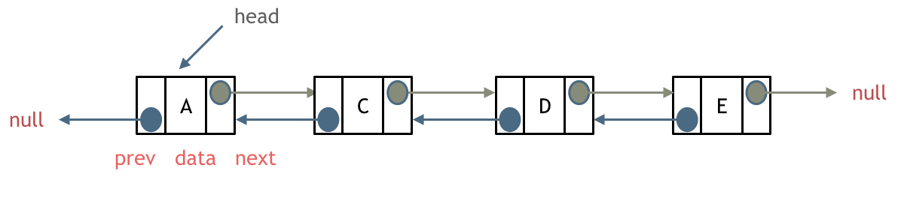
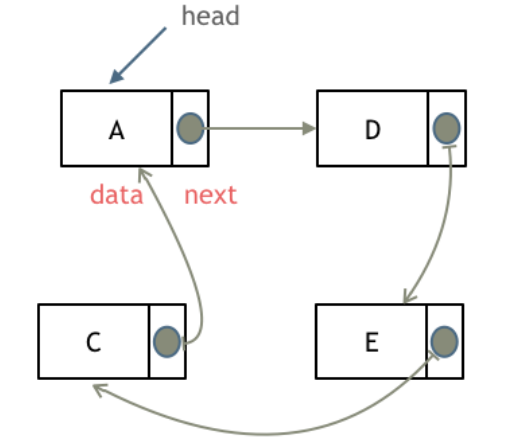
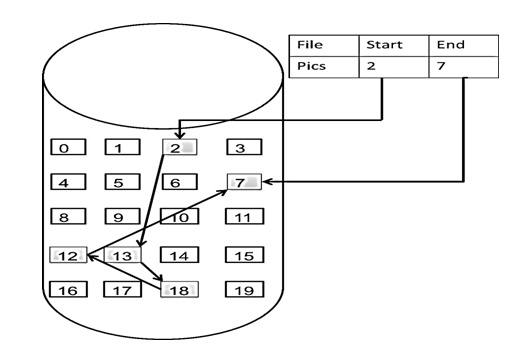
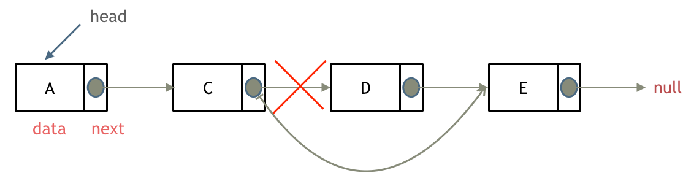
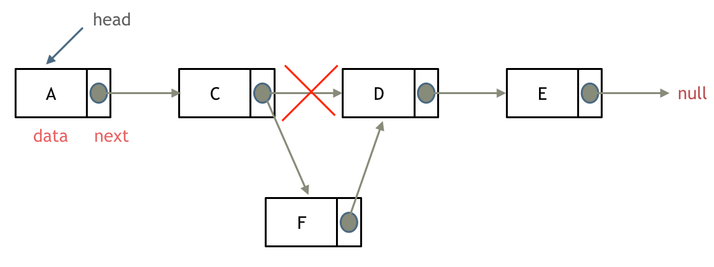

# 间隔重复时间表

| 编号 | 时间 | 内容 | 当天复习 | 过去内容复习 |
| --- | --- | --- | --- | --- |
| 2 | Day 2 | [CN4. HTTP状态码](CN4-cn.md); [CN5. HTTP缓存(强缓存/协商缓存)](CN5-cn.md); [AL203. 移除链表元素](AL203.cpp); [AL707. 设计链表](AL707.cpp); [AL206. 反转链表](AL206.cpp); [AL24. 两两交换链表中的节点](AL24.cpp); [AL19. 删除链表的倒数第N个节点](AL19.cpp) | [ ]  2 hrs  [ ] 12 hrs | [ ] No.1 |

# 预习

AL203 & AL707 & AL206 & AL24 & AL19: 
***链表理论基础***

**什么是链表**

与数组不同（数组将元素存储在连续的内存位置），链表是一种线性数据结构，其中元素不连续存储，每个元素都通过**指针（或引用）**连接到下一个元素。每个元素（称为**节点**）通常由两个部分组成：

1. **数据：** 存储在节点中的值。
2. **下一个指针：**  一个引用（或指针），指向序列中下一个节点的位置。

最后一个节点的指针域指向`null`（空指针的意思）。链表的入口节点称为链表的头结点也就是`head`。

如图所示： 

**链表的类型**

接下来说一下链表的几种类型: 

* **单链表：** 刚刚说的就是单链表，最基本的类型，其中每个节点仅指向序列中的下一个节点。最后一个节点的 `next` 指针指向 `null`（或指定的结束标记），表示链表的结尾。

* **双链表：** 除了 `next` 指针之外，每个节点还有一个 `prev` 指针，该指针引用前一个节点。这允许在两个方向上遍历链表，既可以向前查询也可以向后查询。

如图所示：  

* **循环链表：** 顾名思义，就是链表首尾相连，最后一个节点的 `next` 指针指向链表的头部，形成一个循环结构。循环链表可以用来解决约瑟夫环问题。

如图所示：

**链表的存储方式**

数组是在内存中是连续分布的，但是链表在内存中可不是连续分布的。

链表是通过指针域的指针链接在内存中各个节点。

所以链表中的节点在内存中不是连续分布的 ，而是散乱分布在内存中的某地址上，分配机制取决于操作系统的内存管理。

如图所示：

这个链表起始节点为2， 终止节点为7， 各个节点分布在内存的不同地址空间上，通过指针串联在一起。

**链表的定义：**

链表节点的定义，很多同学在面试的时候都写不好。

这是因为平时在刷leetcode的时候，链表的节点都默认定义好了，直接用就行了，所以同学们都没有注意到链表的节点是如何定义的。

而在面试的时候，一旦要自己手写链表，就写的错漏百出。

这里我给出C/C++的定义链表节点方式，如下所示：

    // 单链表
    struct ListNode {
        int val;  // 节点上存储的元素
        ListNode *next;  // 指向下一个节点的指针
        ListNode(int x) : val(x), next(NULL) {}  // 节点的构造函数
    };
    
有同学说了，我不定义构造函数行不行，答案是可以的，C++默认生成一个构造函数。

但是这个构造函数不会初始化任何成员变量，下面我来举两个例子：

通过自己定义构造函数初始化节点：

    ListNode* head = new ListNode(5);
    

使用默认构造函数初始化节点：

    ListNode* head = new ListNode();
    head->val = 5;
    

所以如果不定义构造函数使用默认构造函数的话，在初始化的时候就不能直接给变量赋值！

**链表的优点**

* **动态大小：**  与具有固定大小的数组不同，链表可以在运行时轻松地增长或缩小。这使得它们适用于数据量可能会动态变化的情况。
* **高效的插入和删除：**  插入新节点或删除现有节点通常只涉及更改指针，使得这些操作效率相对较高，特别是与数组中移动元素相比。

**链表的缺点**

* **随机访问效率低下：**  要访问链表中的特定元素，通常需要从头开始遍历列表，直到到达所需的索引。这导致访问的时间复杂度为 O(n)，使其比数组提供的常数时间访问慢。
* **额外的内存开销：**  链表中的每个节点都需要额外的内存来存储指针，对于存储相同数据，链表可能比数组使用更多的内存。

**链表的操作**

* **删除节点：** 删除D节点，只要将C节点的next指针指向E节点就可以了，如图所示：

那有同学说了，D节点不是依然存留在内存里么？只不过是没有在这个链表里而已。

是这样的，所以在C++里最好是再手动释放这个D节点，释放这块内存。其他语言例如Java、Python，就有自己的内存回收机制，就不用自己手动释放了。

* **添加节点：** 如图所示：

可以看出链表的增添和删除都是O(1)操作，也不会影响到其他节点。

但是要注意，要是删除第五个节点，需要从头节点查找到第四个节点通过next指针进行删除操作，查找的时间复杂度是O(n)。

**常见的链表操作时间复杂度**

| 操作 |  单链表 | 双链表 | 说明  |
|---|---|---|---|
| 在头部插入 |  O(1)  | O(1) | 将新节点添加为第一个元素。 |
| 在尾部插入 | O(n) - 无尾指针, O(1) - 有尾指针 | O(1)  | 将新节点添加为最后一个元素。 |
| 在给定节点后插入 | O(1) | O(1)  |  在特定现有节点后添加新节点。  |
|  在头部删除 | O(1) |  O(1) | 移除第一个节点。  |
|  在尾部删除 | O(n)  | O(1)  |  移除最后一个节点。 |
| 删除给定节点 | O(n) | O(1) | 从链表中删除特定节点。  |
| 搜索 | O(n)  |  O(n)  | 遍历链表以查找具有给定值的节点。  |

**性能分析**

再把链表的特性和数组的特性进行一个对比：

|  |  插入/删除 | 查询 | 适用场景  |
|---|---|---|---|
| 数组 | O(n) | O(1) | 数据数量固定，频繁查询，较少增删 |
| 链表 | O(1) | O(n) | 数据量不固定，频繁增删，较少查询 |
