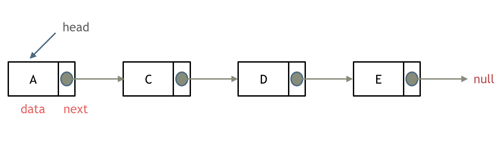
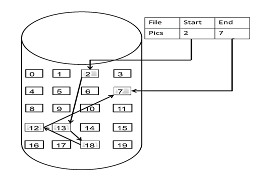
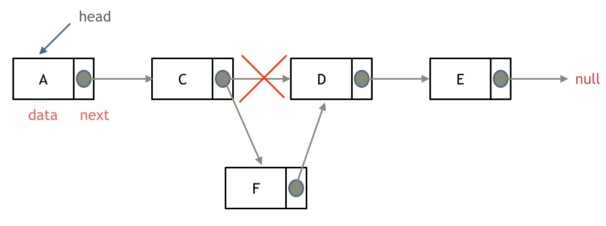

# Spaced Repetition Time Table

| No. | Time | Content | Review today's | Review past No. |
| --- | --- | --- | --- | --- |
| 2 | Day 2 | [CN4. HTTP Status Codes](CN4-en.md); [CN5. HTTP Caching (Strong Caching/Negotiated Caching)](CN5-en.md); [AL203. Remove Linked List Elements](AL203.cpp); [AL707. Design Linked List](AL707.cpp); [AL206. Reverse Linked List](AL206.cpp); [AL24. Swap Nodes in Pairs](AL24.cpp); [AL19. Remove Nth Node From End of List](AL19.cpp) | [ ]  2 hrs  [ ] 12 hrs | [ ] No.1 |

# Preview

AL203 & AL707 & AL206 & AL24 & AL19:
***Linked List Fundamentals***

**What is a Linked List?**

Unlike arrays, which store elements in contiguous memory locations, a linked list is a linear data structure where elements are stored non-contiguously. Each element is connected to the next element through a **pointer (or reference)**. Each element, known as a **node**, typically consists of two parts:

1. **Data:** The value stored in the node.
2. **Next Pointer:** A reference (or pointer) that points to the location of the next node in the sequence.

The last node's pointer field points to `null` (indicating the end of the list). The entry point of the linked list is called the head node, denoted as `head`.

As shown below: 

**Types of Linked Lists**

Let's discuss several types of linked lists:

* **Singly Linked List:** The most basic type, where each node points only to the next node in the sequence. The last node's `next` pointer points to `null` (or a designated end marker), indicating the end of the list.

* **Doubly Linked List:** In addition to the `next` pointer, each node also has a `prev` pointer that references the previous node. This allows traversal of the linked list in both directions, both forward and backward.

As shown below: 

* **Circular Linked List:** As the name suggests, the tail of the list connects back to the head. The last node's `next` pointer points to the head of the list, forming a circular structure. Circular linked lists can be used to solve problems like the Josephus Problem.

As shown below: 

**Linked List Storage**

Arrays are stored contiguously in memory, but linked lists are not.

Linked lists are connected in memory through pointers in the pointer field of each node.

Therefore, the nodes in a linked list are not stored contiguously in memory but are scattered at different memory addresses. The allocation mechanism depends on the operating system's memory management.

As shown below:

The starting node of this linked list is 2, and the ending node is 7. Each node is distributed at a different memory address and linked together through pointers.

**Linked List Definition:**

Many students struggle to correctly define a linked list node during interviews.

This is because, during LeetCode practice, linked list nodes are typically predefined, and students don't pay attention to how they are defined.

However, during interviews, when asked to write a linked list from scratch, errors often arise.

Here's how to define a linked list node in C/C++:

    // Singly Linked List
    struct ListNode {
        int val;  // Value stored in the node
        ListNode *next;  // Pointer to the next node
        ListNode(int x) : val(x), next(NULL) {}  // Node constructor
    };

Some might ask, "Can I skip defining the constructor?" The answer is yes, C++ provides a default constructor.

However, the default constructor doesn't initialize member variables. Let's look at two examples:

Initializing a node with a custom constructor:

    ListNode* head = new ListNode(5);

Initializing a node with the default constructor:

    ListNode* head = new ListNode();
    head->val = 5;

Therefore, if you don't define a constructor and use the default one, you cannot directly assign values to variables during initialization!

**Advantages of Linked Lists**

* **Dynamic Size:** Unlike arrays with a fixed size, linked lists can easily grow or shrink during runtime. This makes them suitable for situations where the amount of data may change dynamically.
* **Efficient Insertion and Deletion:** Inserting a new node or deleting an existing one typically involves only changing pointers, making these operations relatively efficient, especially compared to shifting elements in an array.

**Disadvantages of Linked Lists**

* **Inefficient Random Access:** Accessing a specific element in a linked list usually requires traversing the list from the head until the desired index is reached. This results in an access time complexity of O(n), making it slower than the constant-time access provided by arrays.
* **Additional Memory Overhead:** Each node in a linked list requires additional memory to store the pointers. For storing the same data, a linked list may consume more memory than an array.

**Linked List Operations**

* **Deleting a Node:** To delete node D, simply point the `next` pointer of node C to node E, as shown below:

Now, some might say, "Isn't node D still in memory? It's just not part of the linked list anymore."

That's correct. Therefore, in C++, it's best to manually free the memory occupied by node D. Other languages like Java and Python have their own garbage collection mechanisms, so manual freeing is not required.

* **Adding a Node:** As shown below:

We can see that both adding and deleting nodes in a linked list are O(1) operations and do not affect other nodes.

However, note that to delete the fifth node, you need to traverse from the head node to the fourth node and then perform the deletion using the `next` pointer. The time complexity of searching is O(n).

**Time Complexity of Common Linked List Operations**

| Operation | Singly Linked List | Doubly Linked List | Description |
|---|---|---|---|
| Insertion at Head | O(1) | O(1) | Adding a new node as the first element. |
| Insertion at Tail | O(n) - without tail pointer, O(1) - with tail pointer | O(1) | Adding a new node as the last element. |
| Insertion after a Given Node | O(1) | O(1) | Adding a new node after a specific existing node. |
| Deletion at Head | O(1) | O(1) | Removing the first node. |
| Deletion at Tail | O(n) | O(1) | Removing the last node. |
| Deletion of a Given Node | O(n) | O(1) | Removing a specific node from the linked list. |
| Search | O(n) | O(n) | Traversing the linked list to find a node with a given value. |

**Performance Analysis**

Let's compare the characteristics of linked lists and arrays:

|  | Insertion/Deletion | Search | Suitable Scenarios |
|---|---|---|---|
| Array | O(n) | O(1) | Fixed data size, frequent searches, infrequent insertions/deletions |
| Linked List | O(1) | O(n) | Dynamic data size, frequent insertions/deletions, infrequent searches |
